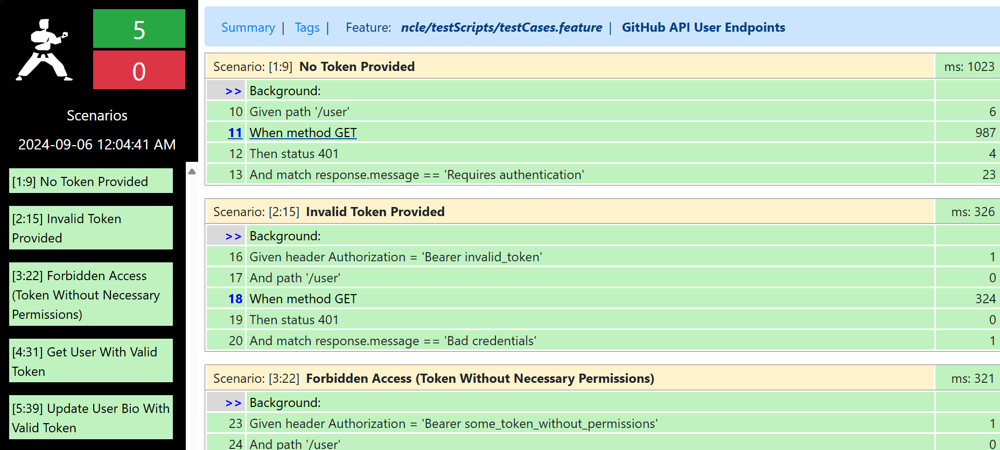

# GitHub API User Endpoints Test Suite

## Overview
This test suite is designed to validate various user-related endpoints of the GitHub API using Karate, a framework for API testing. The suite covers both failure and success scenarios to ensure the API behaves as expected under different conditions.

## Prerequisites
Java JDK 11 or later
Maven for dependency management
Karate framework for API testing.

## File Structure
Feature: GitHub API User Endpoints.feature: Contains the Karate feature file with test scenarios.
TestRunner.java: JUnit test runner for executing Karate tests.
karate-config.js: Configuration file for setting up different environments and custom variables.

## Karate Configuration (karate-config.js)
This file defines environment-specific configurations. By default, it is set to the dev environment. You can customize the configuration for different environments (e.g., e2e) by modifying this file.

## Running the Tests
Clone the Repository

git clone <repository-url>
cd <repository-directory>

## Install Dependencies

Ensure you have Maven installed. Run the following command to install necessary dependencies:

mvn install

## Run the Tests

mvm test OR run the TestRunner.java file

## Specify Environment

You can specify the environment when running the tests:

mvn test -Dkarate.env=e2e

## Notes
Token Management: Replace the placeholder paste your access token in the feature file with your actual GitHub Personal Access Token.
API Rate Limits: Be aware of GitHub's API rate limits. Excessive requests may lead to rate limiting.

## Contribution
If you have any improvements or suggestions, please feel free to contribute by submitting a pull request or opening an issue.

## Sample report

